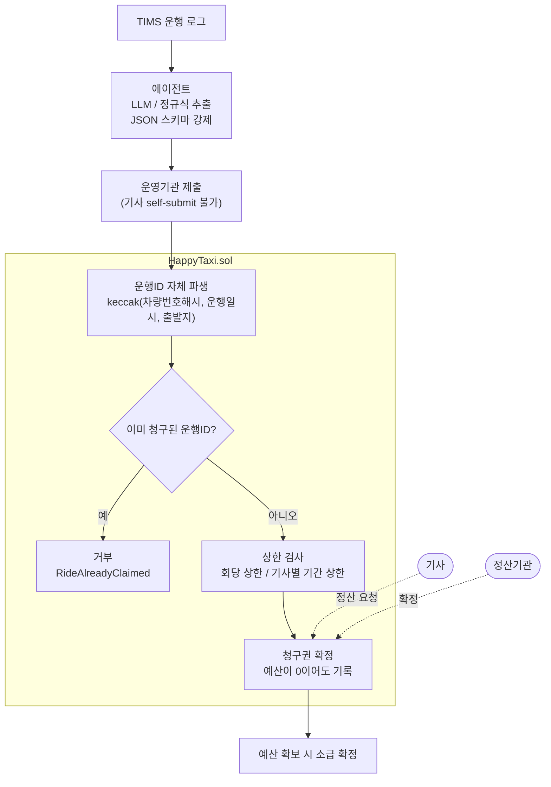
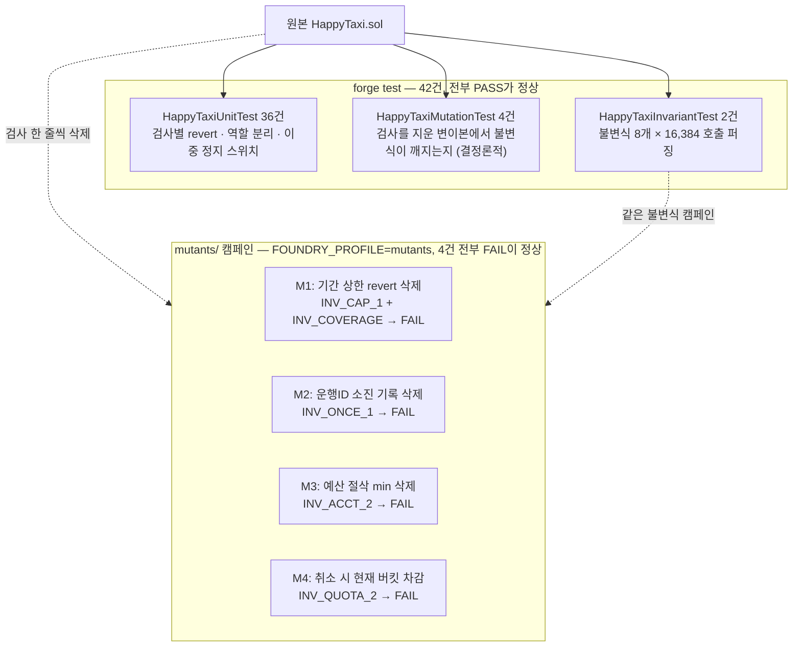

# 달성 행복택시 보조금 정산 원장 — 청구권과 재정 배정의 분리

달성군은 버스 취약지 주민에게 택시 이용을 지원합니다. 주민이 회당 1,000원을 부담하고 차액을 군이 보전합니다. 2026년 6월 조례 개정으로 지원 마을이 49개에서 71개로 늘었고, 언론은 재정 부담 증가와 정산 시스템 보완 필요를 과제로 지적했습니다.

지원 마을이 늘면 청구는 즉시 늘지만 예산은 회계연도에 묶여 있습니다. 그 간극이 생겼을 때 "정산을 멈춘다"가 아니라 **"확정하되 지급을 미룬다"** 가 되어야 합니다. 기사는 이미 손님을 태웠고, 그 사실이 기록되지 않으면 나중에 소급 지급할 근거도 남지 않습니다.

이 프로토타입은 둘을 분리합니다. **예산이 0이어도 기사의 보조금 청구권은 온체인에 확정되고, 예산이 확보되면 소급 확정됩니다.** 그 분리가 실제로 성립하는지를 8개 정책 불변식과 4건의 변이 테스트로 증명합니다.

---

## 구조 한눈에 보기

### 데이터 흐름



정산 요청은 기사 본인, 확정은 정산기관이 맡습니다. 한 역할이 요청·확정·취소를 모두 쥐지 않도록 나눈 것입니다.

### 검증 구조



변이본에서 하나라도 PASS가 나오면 그 불변식이 해당 검사를 지키고 있지 않다는 뜻입니다.

---

## 디렉터리 구조

```
HappyTaxi/
├── README.md                이 문서
├── .env.example             환경변수 키 목록 (값은 비워 둠)
├── contracts/               정산 원장 컨트랙트 (본체)
│   ├── src/HappyTaxi.sol      원장 컨트랙트
│   ├── test/HappyTaxi.t.sol   유닛·불변식·변이 테스트 42건
│   ├── mutants/               변이본 캠페인 (기본 실행에서 제외)
│   ├── lib/                   git 서브모듈 (OpenZeppelin v5.7.0, forge-std v1.16.2)
│   └── foundry.toml
├── agent/                   운행 기록 추출 에이전트 (Python)
│   ├── schema.py              LLM 출력 강제용 JSON 스키마
│   ├── extract.py             3단 백엔드 추출기 + OCR 경로
│   ├── run_agent.py           5건 추출 → 제출 → 중복 거부 시연
│   ├── run_llm_compare.py     실제 LLM vs 정규식 필드별 대조 (키 필요)
│   ├── selftest_api_path.py   LLM API 경로 자체검사 (목 서버)
│   ├── selftest_no_key_leak.py  키 유출 차단 검증
│   ├── data/rides/            데모 운행 로그 5건 (합성)
│   ├── logs/                  실행 로그 — logs/README.md 참조
│   └── out/                   제출 페이로드
├── forecast/                예산 소진 예측·정책 비교 (Python, 표준 라이브러리만)
│   ├── subsidy_forecast/      예측기·합성 시계열 모듈
│   ├── data/                  공개 예산 소진 이력
│   ├── out/                   백테스트·정책 비교·민감도 산출물
│   ├── run_backtest.py        실측 검증
│   ├── run_policies.py        3정책 비교 시뮬레이션
│   └── run_sensitivity.py     예산 가정 민감도 분석
└── web/index.html           반사실 비교 데모 화면 (정적 HTML)
```

`contracts/lib/`의 의존성은 git 서브모듈입니다. 버전은 `contracts/foundry.lock`에 태그와 커밋으로 고정되어 있습니다. 클론 직후에는 비어 있으므로 아래 순서대로 한 번 받아 두셔야 합니다.

---

## 클론 후 실행 순서

```bash
# 1) 클론 + 서브모듈 받기
git clone https://github.com/dandel6/HappyTaxi.git
cd HappyTaxi
git submodule update --init --recursive
#   (처음부터 git clone --recurse-submodules 로 받아도 같습니다)

# 2) 컴파일
cd contracts
forge build

# 3) 환경변수 (LLM 대조를 돌릴 때만 필요, 나머지는 키 없이 동작)
cd ..
cp .env.example .env     # 값을 채운 뒤 셸에 불러옵니다
set -a; . ./.env; set +a

# 4) 실행
cd contracts && forge test && cd ..                          # 테스트 42건
cd agent && python run_agent.py && cd ..                     # 추출 → 제출 → 중복 거부
cd agent && python run_llm_compare.py && cd ..               # LLM 대조 (키 필요)
cd forecast && python run_backtest.py && python run_policies.py && python run_sensitivity.py && cd ..
```

`.env.example`의 변수는 네 개입니다. `LLM_API_BASE`·`LLM_API_KEY`·`LLM_API_MODEL`은 LLM 대조용이고(아래 "LLM 경로 실행 방법" 참조), `OUTLINES_MODEL`은 로컬 outlines 백엔드를 쓸 때만 넣습니다. 코드는 `.env` 파일을 직접 읽지 않고 환경변수만 보므로, 위처럼 셸에 불러오거나 `export`로 넣으십시오. `.env`는 `.gitignore`에 들어 있습니다.

---

## 요구 환경

| 항목 | 버전 |
|---|---|
| Foundry (forge) | 1.8.1 이상 |
| Solidity | 0.8.25 (forge가 자동 설치) |
| Python | 3.12 이상 |

`forecast/`는 **표준 라이브러리만으로 동작합니다.** 차트 PNG 생성만 `matplotlib`을 쓰고, 없으면 "차트 생략" 메시지를 남기고 나머지는 정상 실행됩니다.

`agent/`도 기본 경로는 표준 라이브러리 + pydantic입니다. LLM은 **선택**입니다(아래 "에이전트" 참조).

---

## 재현 명령 세 줄

```bash
cd contracts

# 1) 컴파일
forge build

# 2) 전체 테스트
forge test

# 3) 변이 캠페인 (실패하는 것이 정상입니다 — 아래 설명 참조)
FOUNDRY_PROFILE=mutants forge test --match-path 'mutants/*'
```

Windows PowerShell에서는 3번을 이렇게 실행하십시오.

```powershell
$env:FOUNDRY_PROFILE="mutants"; forge test --match-path 'mutants/*'
```

### 각 명령이 확인하는 것

**1) `forge build`** — solc 0.8.25로 컴파일됩니다. 경고 0건이어야 합니다.

**2) `forge test`** — 42건이 전부 통과해야 합니다.

| 스위트 | 건수 | 확인하는 것 |
|---|---|---|
| `HappyTaxiUnitTest` | 36 | 검사별 revert, 역할 분리 6쌍, 이중 정지 스위치, 도메인 고유 검사 |
| `HappyTaxiMutationTest` | 4 | 검사를 지운 변이본에서 불변식이 실제로 깨지는지 (결정론적) |
| `HappyTaxiInvariantTest` | 2 | 불변식 8개 × 16,384 호출 퍼징 + 핸들러 비공허성 |

불변식 캠페인은 `runs 256 × depth 64 = 16,384 호출`을 돌립니다. 100초 안팎 걸립니다.

**3) 변이 캠페인** — 4건 전부 **FAILED**가 나와야 정상입니다.

---

## 변이 캠페인이 실패하는 것이 정상인 이유

불변식 테스트가 통과한다는 사실만으로는 그 불변식이 무언가를 지키고 있다는 증거가 되지 않습니다. 애초에 도달하지 못하는 조건이면 자동으로 참이 되기 때문입니다.

`mutants/`에는 **검사를 딱 한 줄씩 지운 변이본 4개**가 들어 있습니다. 여기에 똑같은 불변식 캠페인을 그대로 돌려서, 그 검사가 없으면 실제로 불변식이 깨지는 것을 보입니다.

| 변이 | 지운 검사 | 깨져야 하는 불변식 |
|---|---|---|
| M1 | 기간 상한 `revert` | `INV_CAP_1` + `INV_COVERAGE` |
| M2 | 운행ID 소진 기록 | `INV_ONCE_1` |
| M3 | 예산 절삭 `min` | `INV_ACCT_2` |
| M4 | 취소 시 요청 버킷 대신 현재 버킷 차감 | `INV_QUOTA_2` |

**네 건이 모두 FAILED로 나오면 성공입니다.** 하나라도 통과하면 그 불변식이 해당 검사를 지키고 있지 않다는 뜻이고, 그게 나쁜 신호입니다.

실패가 정상인 테스트를 기본 실행에 섞을 수 없으므로 별도 프로파일(`[profile.mutants]`)로 분리했습니다. `forge test`는 `mutants/`를 보지 않습니다.

---

## 에이전트 — "AI가 틀려도 장부는 안 깨진다"

```bash
cd agent
python run_agent.py          # 5건 추출 → 제출 → 중복 거부 시연
python run_agent.py --dry    # 추출까지만
```

TIMS 운행 로그에서 미터요금·거리·출발마을·승차자수를 뽑아 컨트랙트 제출 형태로 바꿉니다. LLM 출력은 `outlines`로 JSON 스키마를 **생성 문법에 강제**해 파싱 실패라는 실패 모드 자체를 없앱니다.

백엔드는 3단이고 사용 가능한 것부터 씁니다.

| 순위 | 백엔드 | 조건 |
|---|---|---|
| 1 | `outlines` + 로컬 LLM | `OUTLINES_MODEL` 환경변수 |
| 2 | 무료 LLM/VLM API | `LLM_API_BASE` + `LLM_API_KEY` + `LLM_API_MODEL` |
| 3 | 결정론적 정규식 파서 | 위 둘이 없을 때 |

**3번이 있는 이유는 심사위원 환경에서 API 키 없이, 네트워크 없이 돌아야 하기 때문입니다.** 미터기 사진 입력은 PaddleOCR을 먼저 시도하고, 없으면 2번의 VLM으로 넘깁니다. 데모 5건은 전부 텍스트 로그라 OCR 없이 완주합니다.

### LLM 경로 실행 방법

OpenAI 호환 엔드포인트라면 무엇이든 붙습니다. 환경변수 **세 개**만 넣으면 됩니다.

아래 값은 **이번 대조에 실제로 사용한 것**입니다. 그대로 넣으면 같은 결과가 재현됩니다.

| 변수 | 설명 | 값 |
|---|---|---|
| `LLM_API_BASE` | `/chat/completions` 앞까지의 base URL | `https://api.orcarouter.ai/v1` |
| `LLM_API_KEY` | API 키 | (발급받은 값) |
| `LLM_API_MODEL` | 모델명 | `gpt-5.6-luna` |

```bash
# bash
export LLM_API_BASE="https://api.orcarouter.ai/v1"
export LLM_API_KEY="..."                 # 저장소에 넣지 마십시오
export LLM_API_MODEL="gpt-5.6-luna"
cd agent && python run_llm_compare.py
```

```powershell
# PowerShell
$env:LLM_API_BASE="https://api.orcarouter.ai/v1"
$env:LLM_API_KEY="..."
$env:LLM_API_MODEL="gpt-5.6-luna"
cd agent; python run_llm_compare.py
```

OpenAI 호환이라면 다른 공급자도 같은 방식으로 붙습니다. 다만 **모델은 생명주기가 짧습니다** — 예를 들어 Groq의 `llama-3.3-70b-versatile`은 2026-08-16자로 중단됐습니다. 다른 공급자를 쓰실 때는 해당 공급자의 **현재 서비스 중인 모델 목록**을 먼저 확인하십시오. 모델명이 틀리면 `exit 3`(대조 불가)으로 끝나고 사유가 `API 오류` 항목에 기록됩니다.

대안 엔드포인트는 [OpenRouter](https://openrouter.ai/keys) 또는 [무료 엔드포인트 목록](https://github.com/cheahjs/free-llm-api-resources)을 참고하십시오.

종료 코드는 `0`(대조 수행) / `2`(키 미설정) / `3`(호출했으나 추출 성공 0건 = 대조 불가)로 갈립니다. 키가 없으면 결과를 만들어내지 않고 종료합니다.

### 이번 대조 결과

```
endpoint : https://api.orcarouter.ai/v1
model    : gpt-5.6-luna

추출 성공   5/5건
불일치     0건 / 대조된 35필드 (5건 × 7필드)
응답 지연   1.53 ~ 2.13초
API 오류   없음
```

전문은 `agent/logs/llm-compare.txt`, 기계 판독용 원본은 `agent/out/llm_compare.json`에 있습니다. `python run_llm_compare.py --from-json`으로 API 호출 없이 로그를 재생성할 수 있어 둘이 틀어지지 않습니다.

**불일치 0건이 "LLM은 틀리지 않는다"를 뜻하지는 않습니다.** 표본이 5건이고 데모 로그는 포맷이 정연합니다. 틀렸을 때 어떻게 되는지는 `selftest_api_path.py`가 요금 자릿수를 일부러 틀리게 해서 보여줍니다 — 컴트랙트는 금액 오추출을 막지 못하고, 막는 것은 회당 상한입니다.

**키는 환경변수로만 씁니다.** 저장소에 넣지 마십시오. `.env` 파일을 만들어 쓰더라도 제출 ZIP 빌드에서 제외됩니다. 로그·에러 문자열에 키가 섮이지 않는지는 `python selftest_no_key_leak.py`로 확인할 수 있습니다.

핵심은 마지막 단계입니다. 에이전트가 **같은 운행을 두 번 제출하면 컨트랙트가 두 번째를 거부합니다.**

```
확정 5건 / 거부 1건
  [재시도] 에이전트가 ride_001 을 한 번 더 제출 → RideAlreadyClaimed
```

에이전트는 재시도·타임아웃·배치 재실행 때문에 같은 건을 두 번 올리기 쉽습니다. LLM 신뢰도를 아무리 올려도 그 문제는 사라지지 않습니다. 그래서 컨트랙트가 막습니다 — 운행ID를 `keccak(차량번호해시, 운행일시, 출발지)`로 **컨트랙트가 직접** 파생하므로, 에이전트가 무엇을 보내든 같은 운행이면 같은 ID가 나오고 두 번째는 반려됩니다. **논지의 근거는 추출 정확도가 아니라 구조입니다.**

`agent/data/rides/*.txt`는 대구 빅데이터활용센터 데이터 설명서 4-7 "달성 행복택시 데이터" 컬럼명만 참조해 만든 **합성 데이터**입니다. 해당 데이터는 현장 방문형이라 접근하지 않았습니다.

---

## `forecast/` 실행 방법

```bash
cd forecast
python run_backtest.py       # 공개 예산 소진 이력으로 예측기 검증 (실측만 사용)
python run_policies.py       # 균등 / 선착순 / 우선순위 3정책 비교 (합성)
python run_sensitivity.py    # 위 비교가 예산 가정에 얼마나 민감한지
```

`forecast/` 디렉터리 안에서 실행하셔야 합니다. 산출물은 `forecast/out/`에 떨어지며 저장소에 이미 포함되어 있습니다.

| 파일 | 내용 |
|---|---|
| `backtest_results.csv` / `backtest_summary.json` | 예측기 vs 단순 선형 외삽 베이스라인 오차 비교 |
| `policy_comparison.json` / `.png` | 3정책의 예산 잔액 추이·기사별 정산액 분포·지니계수 |
| `budget_sensitivity.json` | 예산 가정을 바꿔가며 3정책 순위가 유지되는지 검증한 결과 |

**`run_backtest.py`는 실측만 씁니다.** `run_policies.py`는 합성 데이터를 쓰며 **예측 정확도를 주장하지 않습니다** — 정책 간 반사실 비교 전용입니다. `run_sensitivity.py`는 그 비교가 임의값 하나에 기대고 있지 않음을 보입니다.

---

## `web/index.html`

정적 HTML 한 장입니다. 빌드도 서버도 필요 없고 브라우저로 바로 여시면 됩니다.

---

## 배포 범위 — 로컬 Anvil 전용

**이 컨트랙트는 공개 테스트넷에 배포하지 않았습니다.** 로컬 Anvil이 유일한 실행 환경입니다.

대구체인은 MITUM 기반이라 EVM이 없습니다. BaaS가 제공하는 것은 Account / Token / NFT / Timestamp / Point / DAO / Storage 모델 API뿐이고, 컨트랙트 배포 자체가 불가능합니다.

따라서 이 출품작의 컨트랙트는 **대구체인에 올릴 물건이 아니라, 정산 정책을 실행 가능한 형태로 고정한 참조 구현**입니다. 불변식과 변이 테스트로 정책이 실제로 강제됨을 증명하고, 대구체인 이관은 Point / Storage 모델 스키마 대조표로 설계합니다.

배포 스크립트를 넣지 않은 것은 의도적입니다. 이 프로토타입의 검증 표면은 `forge test`이지 배포가 아닙니다.

---

## 가정으로 둔 항목

군 규정을 확인하지 못한 부분은 컨트랙트 헤더에 `★가정(1)~(4)`로 번호를 붙여 두었습니다.

| # | 항목 | 내용 |
|---|---|---|
| 1 | 보조금 산정식 | `max(0, 운행요금 − 승객부담액)`, 승객부담 1,000원. 정률 보전이나 거리 구간제일 수도 있습니다. `passengerShare`는 설정값입니다 |
| 2 | 상한의 존재 | 회당 상한 / 기사별 기간 상한이 있다고 가정했습니다. 실제 규정 미확인 |
| 3 | 기간 모델 | 30일 고정 버킷으로 근사했습니다. 달력 월이 아닙니다 |
| 4 | 지원 마을 목록 | 언론에 개수(71)만 있어 자리표시자 ID로 구현했습니다. `supportedVillageCount`로 실제 주입 여부를 확인할 수 있습니다 |

**조례 수치는 컨트랙트에 하드코딩되어 있지 않습니다.** 생성자는 `subsidyConfig`를 전혀 초기화하지 않으므로 모든 입력 방식이 상한 0(=청구 중단)으로 시작하고, 관리자가 `setSubsidyConfig`로 주입하기 전까지는 어느 청구도 통과하지 않습니다. 테스트에 보이는 상한 수치는 전부 테스트 픽스처입니다.

추가로 세 가지 설계 결정을 밝힙니다.

- **운행ID 파생**을 `(차량번호해시, 운행일시, 출발지)`로 잡았습니다. "같은 차량이 같은 초에 같은 마을에서 두 번 출발할 수 없다"는 물리적 전제에 기대고 있습니다. 스키마에 순번이나 TIMS 고유키가 있으면 그걸 우선 써야 합니다.
- **정산 요청 주체는 기사 본인**입니다. 정산기관이 요청까지 하면 요청·확정·취소를 한 역할이 독점해 직무분리가 무너집니다.
- **운행 제출자는 기사가 아니라 운영기관**입니다. 기사 self-submit을 허용하면 자기 운행을 자기가 증명하는 구조가 됩니다. 스키마에 "운영기관명" 컬럼이 있다는 것이 제출 주체가 따로 있다는 방증입니다.
