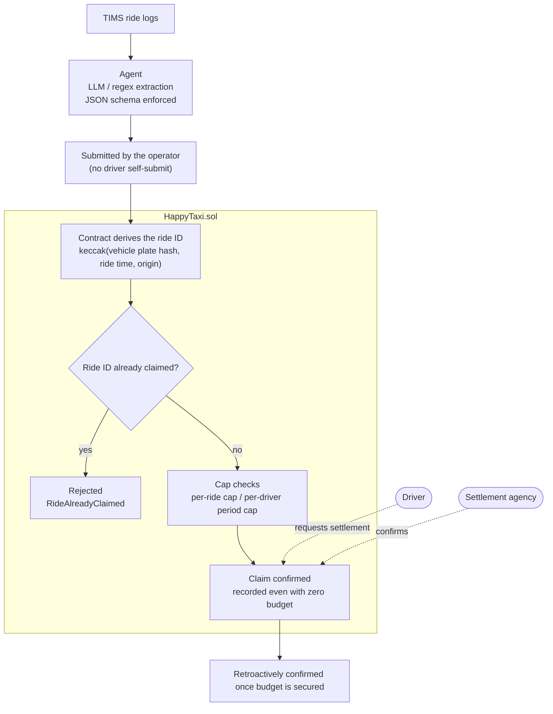
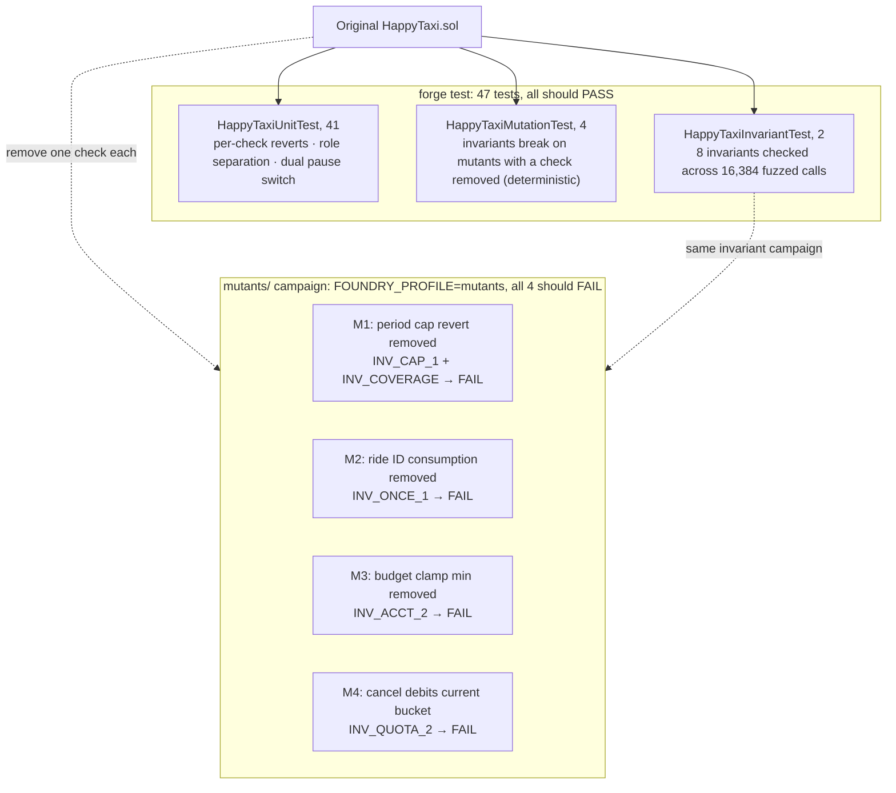

# Dalseong Happy Taxi subsidy settlement ledger: separating the claim from the budget

English | [한국어](docs/ko/README.md)

Dalseong County subsidizes taxi rides for residents of villages with poor bus coverage. The passenger pays 1,000 KRW per ride and the county covers the rest. A June 2026 ordinance amendment expanded the program from 49 to 71 villages, and local press flagged two issues: a heavier fiscal burden and a settlement system that needs work.

When the village list grows, claims grow immediately, but the budget is locked to the fiscal year. When that gap opens up, the answer should not be "stop settling". It should be **"confirm the claim, defer the payment"**. The driver already carried the passenger. If that fact is never recorded, there is nothing to base a retroactive payment on later.

This prototype keeps the two apart. **A driver's subsidy claim is confirmed on-chain even when the budget is zero, and it is retroactively confirmed once budget is secured.** Eight policy invariants and four mutation tests show that this separation actually holds.

---

## Overview

### Data flow



The driver requests settlement and the settlement agency confirms it. The split keeps any one role from holding request, confirm, and cancel all at once.

### Verification



If any mutant passes, the invariant it targets is not actually guarding that check.

---

## Layout

```
HappyTaxi/
├── README.md                this document
├── docs/ko/README.md        Korean version
├── .env.example             env var names (values left empty)
├── contracts/               settlement ledger contract (the core)
│   ├── src/HappyTaxi.sol      ledger contract
│   ├── test/HappyTaxi.t.sol   47 unit, invariant and mutation tests
│   ├── mutants/               mutant campaign (excluded from the default run)
│   ├── lib/                   git submodules (OpenZeppelin v5.7.0, forge-std v1.16.2)
│   └── foundry.toml
├── agent/                   ride record extraction agent (Python)
│   ├── schema.py              JSON schema that constrains LLM output
│   ├── extract.py             3-tier backend extractor + OCR path
│   ├── run_agent.py           extract 5 rides → submit → duplicate rejection demo
│   ├── run_llm_compare.py     real LLM vs regex, field by field (needs a key)
│   ├── selftest_api_path.py   LLM API path self-test (mock server)
│   ├── selftest_no_key_leak.py  checks that keys never leak
│   ├── data/rides/            5 demo ride logs (synthetic)
│   ├── logs/                  run logs, see logs/README.md
│   └── out/                   submission payloads
├── forecast/                budget burn forecast and policy comparison (Python, stdlib only)
│   ├── subsidy_forecast/      forecaster and synthetic series module
│   ├── data/                  public budget burn history
│   ├── out/                   backtest, policy comparison and sensitivity outputs
│   ├── run_backtest.py        validation on real data
│   ├── run_policies.py        3-policy comparison simulation
│   └── run_sensitivity.py     sensitivity to the budget assumption
└── web/index.html           counterfactual comparison demo (static HTML)
```

The dependencies in `contracts/lib/` are git submodules, pinned by tag and commit in `contracts/foundry.lock`. They are empty right after cloning, so fetch them once as shown below.

---

## After cloning

```bash
# 1) clone and fetch submodules
git clone https://github.com/dandel6/HappyTaxi.git
cd HappyTaxi
git submodule update --init --recursive
#   (git clone --recurse-submodules does the same in one step)

# 2) compile
cd contracts
forge build

# 3) env vars (only needed for the LLM comparison, everything else runs without a key)
cd ..
cp .env.example .env     # fill in the values, then load them into your shell
set -a; . ./.env; set +a

# 4) run
cd contracts && forge test && cd ..                          # 47 tests
cd agent && python run_agent.py && cd ..                     # extract → submit → duplicate rejection
cd agent && python run_llm_compare.py && cd ..               # LLM comparison (needs a key)
cd forecast && python run_backtest.py && python run_policies.py && python run_sensitivity.py && cd ..
```

`.env.example` has four variables. `LLM_API_BASE`, `LLM_API_KEY` and `LLM_API_MODEL` are for the LLM comparison (see "Running the LLM path" below). `OUTLINES_MODEL` is only needed for the local outlines backend. The code never reads a `.env` file, only environment variables, so load it into your shell as above or `export` the values yourself. `.env` is in `.gitignore`.

---

## Requirements

| Item | Version |
|---|---|
| Foundry (forge) | 1.8.1 or later |
| Solidity | 0.8.25 (installed by forge) |
| Python | 3.12 or later |

`forecast/` **runs on the standard library alone.** Only the PNG chart needs `matplotlib`. Without it the script prints a "chart skipped" message and everything else runs normally.

`agent/` also defaults to the standard library plus pydantic. The LLM is **optional** (see "Agent" below).

---

## Reproduce in three commands

```bash
cd contracts

# 1) compile
forge build

# 2) full test suite
forge test

# 3) mutant campaign (failure is the expected result, see below)
FOUNDRY_PROFILE=mutants forge test --match-path 'mutants/*'
```

On Windows PowerShell, run step 3 like this:

```powershell
$env:FOUNDRY_PROFILE="mutants"; forge test --match-path 'mutants/*'
```

### What each command checks

**1) `forge build`** compiles with solc 0.8.25. It should produce zero warnings.

**2) `forge test`** should pass all 47 tests.

| Suite | Count | What it checks |
|---|---|---|
| `HappyTaxiUnitTest` | 41 | per-check reverts, 6 role separation pairs, dual pause switch, domain-specific checks |
| `HappyTaxiMutationTest` | 4 | whether invariants really break on mutants with a check removed (deterministic) |
| `HappyTaxiInvariantTest` | 2 | 8 invariants checked across 16,384 fuzzed calls + handler non-vacuity |

The invariant campaign runs `runs 256 × depth 64 = 16,384 calls` and takes around 100 seconds.

**3) Mutant campaign.** All 4 should come out **FAILED**.

---

## Why the mutant campaign is supposed to fail

A passing invariant test does not, on its own, prove that the invariant protects anything. If the bad state is unreachable to begin with, the invariant is trivially true.

`mutants/` holds **4 mutants, each with exactly one check deleted**. The same invariant campaign runs against them, which shows that the invariants really do break without those checks.

| Mutant | Check removed | Invariant that should break |
|---|---|---|
| M1 | period cap `revert` | `INV_CAP_1` + `INV_COVERAGE` |
| M2 | recording the ride ID as consumed | `INV_ONCE_1` |
| M3 | budget clamp `min` | `INV_ACCT_2` |
| M4 | cancel debits the current bucket instead of the request bucket | `INV_QUOTA_2` |

**All four FAILED means success.** If any of them passes, that invariant is not guarding the check, and that is the bad sign.

Tests that are supposed to fail cannot live in the default run, so they sit in a separate profile (`[profile.mutants]`). `forge test` never looks at `mutants/`.

---

## Agent: "the ledger holds even when the AI is wrong"

```bash
cd agent
python run_agent.py          # extract 5 rides → submit → duplicate rejection demo
python run_agent.py --dry    # extraction only
```

The agent pulls meter fare, distance, origin village and passenger count out of TIMS ride logs and turns them into contract submissions. LLM output goes through `outlines`, which **enforces the JSON schema in the generation grammar**, so parse failures stop being a failure mode at all.

There are three backends, used in order of availability.

| Priority | Backend | Condition |
|---|---|---|
| 1 | `outlines` + local LLM | `OUTLINES_MODEL` env var |
| 2 | free LLM/VLM API | `LLM_API_BASE` + `LLM_API_KEY` + `LLM_API_MODEL` |
| 3 | deterministic regex parser | when neither of the above is set |

**Backend 3 exists because the judges' environment has to work with no API key and no network.** Meter photos go to PaddleOCR first and fall back to the VLM in backend 2. The 5 demo rides are all text logs, so they finish without OCR.

### Running the LLM path

Any OpenAI-compatible endpoint works. You only need **three** env vars.

The values below are **the ones actually used for this comparison**. Use them as-is to reproduce the same result.

| Variable | Description | Value |
|---|---|---|
| `LLM_API_BASE` | base URL up to `/chat/completions` | `https://api.orcarouter.ai/v1` |
| `LLM_API_KEY` | API key | (your own key) |
| `LLM_API_MODEL` | model name | `gpt-5.6-luna` |

```bash
# bash
export LLM_API_BASE="https://api.orcarouter.ai/v1"
export LLM_API_KEY="..."                 # never commit this
export LLM_API_MODEL="gpt-5.6-luna"
cd agent && python run_llm_compare.py
```

```powershell
# PowerShell
$env:LLM_API_BASE="https://api.orcarouter.ai/v1"
$env:LLM_API_KEY="..."
$env:LLM_API_MODEL="gpt-5.6-luna"
cd agent; python run_llm_compare.py
```

Other OpenAI-compatible providers plug in the same way. Keep in mind that **models have short lifecycles**. Groq's `llama-3.3-70b-versatile`, for example, was discontinued on 2026-08-16. If you use another provider, check its **list of currently served models** first. A wrong model name ends in `exit 3` (comparison not possible) with the reason logged under `API 오류`.

For alternative endpoints, see [OpenRouter](https://openrouter.ai/keys) or this [list of free endpoints](https://github.com/cheahjs/free-llm-api-resources).

Exit codes: `0` (comparison ran), `2` (no key set), `3` (API called but zero successful extractions, so no comparison). Without a key the script exits without producing results.

### Results of this comparison

```
endpoint : https://api.orcarouter.ai/v1
model    : gpt-5.6-luna

추출 성공   5/5건
불일치     0건 / 대조된 35필드 (5건 × 7필드)
응답 지연   1.53 ~ 2.13초
API 오류   없음
```

(Extraction succeeded on 5/5 rides, 0 mismatches across 35 compared fields (5 rides × 7 fields), latency 1.53 to 2.13 s, no API errors.)

The full log is in `agent/logs/llm-compare.txt` and the machine-readable original in `agent/out/llm_compare.json`. `python run_llm_compare.py --from-json` regenerates the log without calling the API, so the two never drift apart.

**Zero mismatches does not mean "the LLM is never wrong".** The sample is 5 rides and the demo logs are neatly formatted. `selftest_api_path.py` shows what happens when it is wrong by deliberately garbling a fare digit: the contract cannot catch a misextracted amount, and what limits the damage is the per-ride cap.

**Keys only ever come from env vars.** Never commit them. Even if you use a `.env` file, it is excluded from the submission ZIP build. `python selftest_no_key_leak.py` checks that keys never end up in log or error strings.

The key part is the last step. If the agent **submits the same ride twice, the contract rejects the second one.**

```
확정 5건 / 거부 1건
  [재시도] 에이전트가 ride_001 을 한 번 더 제출 → RideAlreadyClaimed
```

(5 confirmed, 1 rejected: on retry the agent submits ride_001 again → RideAlreadyClaimed.)

Retries, timeouts and batch reruns make it easy for an agent to upload the same ride twice. No amount of LLM reliability makes that go away, so the contract blocks it. The contract **derives the ride ID itself** as `keccak(vehicle plate hash, ride time, origin)`, so whatever the agent sends, the same ride yields the same ID and the second submission is rejected. **The argument rests on structure, not on extraction accuracy.**

`agent/data/rides/*.txt` is **synthetic data** built only from the column names in section 4-7, "Dalseong Happy Taxi data", of the Daegu Big Data Center data guide. That dataset is on-site access only, and I did not access it.

---

## Running `forecast/`

```bash
cd forecast
python run_backtest.py       # validate the forecaster on public budget burn history (real data only)
python run_policies.py       # compare 3 policies: equal / first-come / priority (synthetic)
python run_sensitivity.py    # how sensitive that comparison is to the budget assumption
```

Run these from inside `forecast/`. Outputs land in `forecast/out/` and are already committed.

| File | Contents |
|---|---|
| `backtest_results.csv` / `backtest_summary.json` | forecaster vs simple linear extrapolation baseline, error comparison |
| `policy_comparison.json` / `.png` | remaining budget over time, per-driver settlement distribution and Gini coefficient for the 3 policies |
| `budget_sensitivity.json` | whether the ranking of the 3 policies holds as the budget assumption changes |

**`run_backtest.py` uses real data only.** `run_policies.py` uses synthetic data and **makes no claim about forecast accuracy**. It exists only for counterfactual comparison between policies. `run_sensitivity.py` shows that the comparison does not hinge on one arbitrary value.

---

## `web/index.html`

A single static HTML page. No build, no server. Just open it in a browser.

---

## Deployment scope: local Anvil only

**This contract has not been deployed to any public testnet.** Local Anvil is the only environment it runs in.

Daegu Chain is built on MITUM and has no EVM. Its BaaS only offers model APIs for Account / Token / NFT / Timestamp / Point / DAO / Storage, so deploying a contract there is not possible at all.

So the contract in this entry is **not something to put on Daegu Chain. It is a reference implementation that pins the settlement policy down in executable form.** The invariants and mutation tests prove the policy is actually enforced, and migration to Daegu Chain is designed as a schema mapping onto the Point / Storage models.

Leaving out deploy scripts is deliberate. The verification surface of this prototype is `forge test`, not deployment.

---

## Assumptions

Where I could not confirm the county's rules, the contract header numbers the gap as `★가정(1)~(4)` (assumption 1 to 4).

| # | Item | Details |
|---|---|---|
| 1 | Subsidy formula | `max(0, fare − passenger share)`, with a passenger share of 1,000 KRW. It could also be a fixed-rate subsidy or distance bands. `passengerShare` is a config value |
| 2 | Caps exist | Assumes a per-ride cap and a per-driver period cap. Not confirmed against actual rules |
| 3 | Period model | Approximated with fixed 30-day buckets, not calendar months |
| 4 | Supported village list | The press only gives the count (71), so villages are placeholder IDs. `supportedVillageCount` shows whether real data was loaded |

**No ordinance figures are hardcoded in the contract.** The constructor does not initialize `subsidyConfig` at all, so every input method starts with a cap of 0 (claims halted), and no claim goes through until an admin sets values with `setSubsidyConfig`. Every cap you see in the tests is a test fixture.

Three more design decisions worth stating:

- **The ride ID** is derived from `(vehicle plate hash, ride time, origin)`. This leans on the physical premise that the same vehicle cannot depart twice from the same village in the same second. If the schema has a sequence number or a TIMS unique key, that should take precedence.
- **The driver requests settlement.** If the settlement agency also made the request, one role would own request, confirm and cancel, and separation of duties would collapse.
- **Rides are submitted by the operator, not the driver.** Allowing drivers to self-submit would mean drivers vouching for their own rides. The schema has an "operator name" column, which suggests a separate submitting party exists.
